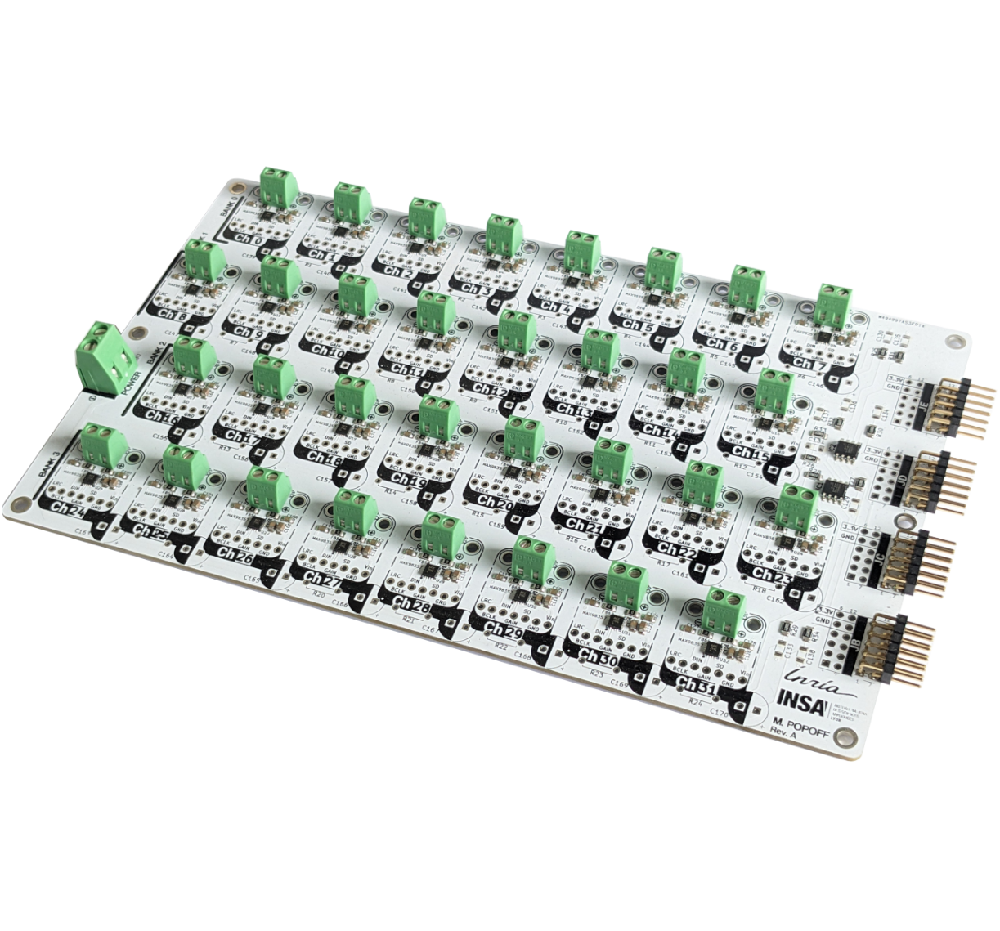
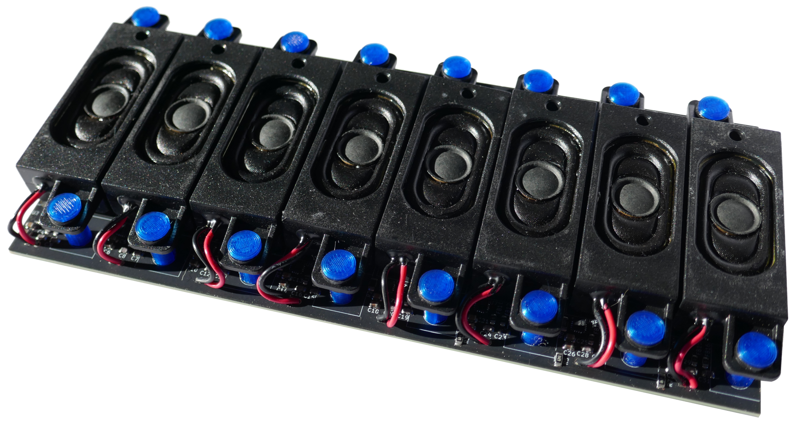
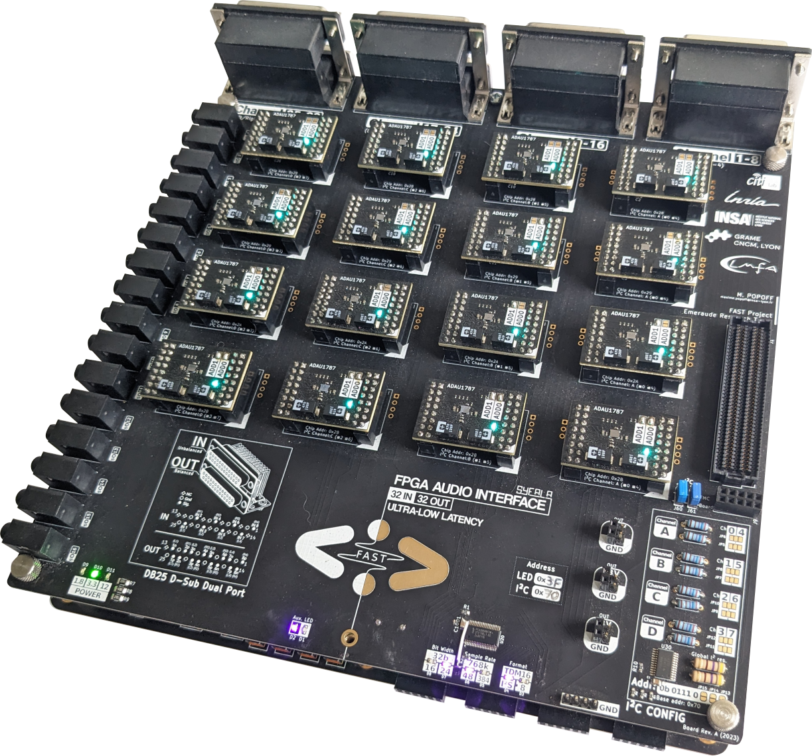
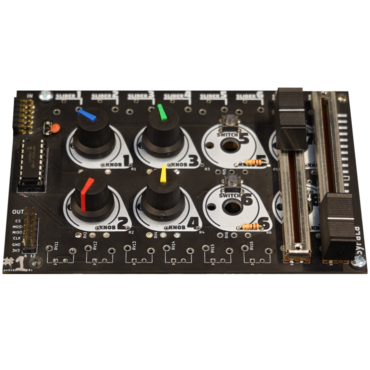

# Syfala PCB Hardware

This repository contains the open-source hardware designs for the PCB boards developed as part of the [Syfala](https://github.com/inria-emeraude/syfala) project. These boards provide the physical interfaces between an FPGA and multichannel loudspeaker or microphone arrays, and a hardware control surface for DSP parameter control.

All designs are released as open-source KiCad projects, including schematics, PCB layouts, and Gerber files.

---

## Repository Structure

```
.
├── ControllerBoard/     # Shield with physical controllers (knobs, faders, etc.)
├── FrugalBoard/         # Low-cost 32-channel output interface (MAX98357A, PMOD)
├── TheLine/             # Modular 8-channel loudspeaker PCB module
├── ULLBoard/            # Ultra-low-latency 32-channel I/O interface (ADAU1787, FMC)
└── images/              # Photos of the boards
```

Each subdirectory contains its own `README.md` with detailed documentation, build instructions, and usage notes.

---

## Boards Overview

### FrugalBoard



A cost-effective 32-channel audio output expansion board designed to be accessible to individuals and institutions with limited resources. It integrates 32 MAX98357A digital amplifiers (I²S DAC + 3 W Class-D amplifier in a single chip) and connects to the FPGA via stackable PMOD connectors available on entry-level Digilent boards such as the Zybo Z7-20.

Two assembly approaches are supported: a fully DIY hand-soldering approach using Adafruit MAX98357A breakout boards, or a direct component integration approach suitable for professional PCB assembly. Up to 7 boards can be stacked on a single Zybo Z7-20, reaching 224 output channels.

**Key specs:**
- 32 amplified output channels per board
- MAX98357A codecs, I²S/TDM protocol
- Stackable via PMOD connectors (up to 7 boards → 224 ch on Zybo Z7-20)
- DIY-friendly: hand-solderable with Adafruit breakout boards
- System cost under 800 USD for a 32-speaker WFS array (including speakers)
- Compatible with Zynq 7000 FPGAs via Syfala

More details in the companion paper: *Enabling Affordable and Scalable Audio Spatialization With Multichannel Audio Expansion Boards for FPGA*, SMC 2024.


---

### TheLine



A modular 8-channel loudspeaker PCB module designed for high-density spatial audio arrays. Each module integrates eight MAX98357A digital amplifiers and eight PCB-mounted loudspeakers. Modules are daisy-chained via identical 2×20 connectors and driven by an FPGA system-on-module (ALINX AC7020C, Xilinx Zynq-7000). A single FPGA can drive up to three independent chains of 32 modules, for a theoretical maximum of 768 channels.

The PCB layout is fully parametric: the included `autogenerate.py` script regenerates the board for any loudspeaker width, height, or spacing, enabling adaptation to different loudspeaker models without manual PCB editing.

**Key specs:**
- 8 loudspeakers + 8 MAX98357A amplifiers per module
- 24 mm inter-speaker pitch (default)
- Daisy-chainable via 2×20 connectors
- Supports linear, concave, and 2D matrix array geometries
- Up to 768 channels on a single FPGA
- Parametric PCB generation script included

More details in the companion paper: *Embedded, Modular, and Affordable High-Density Loudspeaker Arrays*, NIME 2026.

→ See [`TheLine/README.md`](TheLine/README.md)

---

### ULLBoard


An ultra-low-latency 32-channel input/output audio interface targeting professional spatial audio and active acoustic control applications. It embeds 16 ADAU1787 codecs (2 channels in + 2 channels out each), mounted as individual breakout boards on a motherboard, and connects to the FPGA via an FMC connector. The ADAU1787 supports sampling rates up to 768 kHz and achieves an analog-to-analog latency as low as 11 µs through the Syfala compiler.

Audio I/O is exposed via DB25 connectors (industry standard in professional audio), with 8 channels per connector. Up to 16 boards can be parallelized on the same FMC port using I²S TDM multiplexing, reaching 512 channels.

**Key specs:**
- 32 channels in + 32 channels out per board
- ADAU1787 codecs, up to 768 kHz, 11 µs latency
- FMC connector, compatible with most Ultrascale+ FPGA boards
- DB25 audio connectors (XLR/jack multicore compatible)
- I2C multiplexing for independent codec configuration (TCA9548)
- Stackable: up to 16 boards → 512 channels on a single FMC port
- Status LEDs per codec for debugging (PCA9956 LED multiplexer)

More details in the companion paper: *Enabling Affordable and Scalable Audio Spatialization With Multichannel Audio Expansion Boards for FPGA*, SMC 2024.


---

### ControllerBoard



A generic sister board / shield designed to mount on top of the Zybo Z7 FPGA development board. It provides a flexible hardware control surface for DSP algorithms running on the FPGA.

The board exposes an ADC chip connected to the ARM processor via SPI, and accommodates a wide range of controllers (rotary potentiometers, buttons, faders, and similar components) that can be hand-soldered in different configurations. Physical controllers are bound directly to DSP parameters in Faust programs using metadata annotations such as `[knob:1]` or `[switch:1]`, with no additional software layer required.

**Key specs:**
- Mounts directly on the Zybo Z7
- ADC interfaced via SPI to the ARM processor
- Controller-to-parameter binding through Faust metadata
- Generic layout supports diverse controller configurations

---

## Syfala Integration

All boards integrate into the [Syfala toolchain](https://github.com/inria-emeraude/syfala), which compiles audio DSP programs written in [Faust](https://faust.grame.fr/) or C++ down to FPGA bitstreams. The toolchain automatically generates the I²S/TDM transceiver with the correct number of channels, handles embedded Linux deployment, and provides OSC, MIDI, and HTTP control interfaces. From the user's perspective, the hardware is fully abstracted: only the DSP algorithm needs to be written.

---

## Publications

If you use these designs in your research, please cite the relevant papers:

- Maxime Popoff, Romain Michon, Pierre Cochard, and Tanguy Risset. *Embedded, Modular, and Affordable High-Density Loudspeaker Arrays.* NIME '26, London, UK.

- Maxime Popoff, Romain Michon, and Tanguy Risset. *Enabling Affordable and Scalable Audio Spatialization With Multichannel Audio Expansion Boards for FPGA.* SMC 2024, Porto, Portugal.

---

