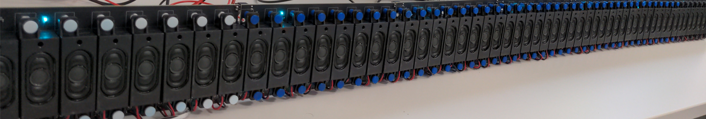

# The LINE

This directory contains the KiCad source files for **The LINE**, a modular 8-channel loudspeaker PCB module, along with `autogenerate.py`, a parametric generation script that can adapt the board layout to different loudspeaker dimensions and spacings without any manual PCB editing.

## Background

The LINE is an open-source, modular loudspeaker array platform designed for spatial audio research and artistic deployment. Each PCB module integrates eight MAX98357A digital audio amplifiers (DAC + Class-D power stage in one chip) and eight PCB-mounted loudspeakers. Modules are daisy-chained via identical 2×20 connectors and driven by an FPGA system-on-module (ALINX AC7020C, Xilinx Zynq-7000). A single FPGA can control up to three independent arrays of 32 modules each, for a theoretical maximum of 768 channels.

The PCB design is intentionally built around a repeated, identical functional block (one per loudspeaker) which makes the layout amenable to parametric generation. By specifying the loudspeaker width, height, and inter-speaker gap, `autogenerate.py` regenerates the full board layout automatically, repositioning all components, routing, zones, and silkscreen elements accordingly.

This approach was used, for instance, to adapt the board to the Tang Band W2-2136S loudspeakers used at the EMPAC/CCRMA installation at Stanford University, without modifying any schematic or routing logic by hand.

The full system is described in:

> Maxime Popoff, Romain Michon, Pierre Cochard, and Tanguy Risset.  
> *Embedded, Modular, and Affordable High-Density Loudspeaker Arrays.*  
> NIME '26, London, UK.

---

## Repository Structure

```
.
├── TheLine.kicad_pcb         # Template PCB (8-channel, default loudspeaker)
├── TheLine.kicad_sch         # KiCad schematic
├── TheLine.kicad_pro         # KiCad project file
├── autogenerate.py           # Parametric PCB generation script
├── gerbers/                  # Pre-generated Gerber files for the default design
└── README.md
```

The `autogenerate.py` script reads `TheLine.kicad_pcb` as its template and writes a new `.kicad_pcb` file with the updated geometry. It does not modify the schematic or the netlist.

---

## Dependencies

The script uses the **KiCad Python scripting API** (`pcbnew`), which is bundled with KiCad 7 and later. It does not require any additional Python packages.

**Requirements:**
- KiCad 7.x or 8.x installed
- Python 3.8+ (the one bundled with KiCad, or a system install where `pcbnew` is importable)

**Tested on Linux only**

---

## Usage

### Basic usage: change loudspeaker dimensions

```bash
python autogenerate.py \
  --input TheLine.kicad_pcb \
  --output TheLine_custom.kicad_pcb \
  --speaker-width 30.0 \
  --speaker-spacing 2.5 \
  --speaker-height 95.0
```

This generates a new board where each loudspeaker slot is 30 mm wide, separated by 2.5 mm gaps, with a board height of 95 mm. All component placements, tracks, copper zones, and silkscreen elements are repositioned accordingly.

### Preview without writing (dry run)

```bash
python autogenerate.py \
  --input TheLine.kicad_pcb \
  --output TheLine_custom.kicad_pcb \
  --speaker-width 30.0 \
  --dry-run
```

The script prints a summary of the computed geometry without writing any file. Useful for checking dimensions before committing.

### Replace the loudspeaker footprint

If your loudspeakers have a different pad layout than the default ASB05708CO-LW100-R, you can supply a custom footprint from a separate `.kicad_pcb` file. The script will extract the first `LS*`-referenced footprint from that file and substitute it for every speaker position on the generated board.

```bash
python autogenerate.py \
  --input TheLine.kicad_pcb \
  --output TheLine_custom.kicad_pcb \
  --speaker-width 38.0 \
  --speaker-spacing 3.0 \
  --custom-footprint my_speaker_footprint.kicad_pcb
```

The custom footprint board should contain exactly one footprint with a reference matching `LS\d+` (e.g. `LS1`). Pad net assignments are inferred automatically by pad number from the original design.

---

## Command-line Reference

| Argument | Type | Default | Description |
|---|---|---|---|
| `--input` | path | `../TheLine.kicad_pcb` | Input template PCB file |
| `--output` | path | `TheLine_parametric.kicad_pcb` | Output PCB file |
| `--speaker-width` | float (mm) | `23.0` | Width of one loudspeaker/amplifier block |
| `--speaker-spacing` | float (mm) | `2.0` | Gap between two adjacent blocks |
| `--speaker-height` | float (mm) | `90.0` | Board height (minimum 90 mm) |
| `--custom-footprint` | path | *(none)* | Path to a `.kicad_pcb` file whose first `LS*` footprint replaces every speaker footprint |
| `--dry-run` | flag | `False` | Print geometry summary without writing output |

---

## How the Script Works

The script operates entirely through the `pcbnew` API and does not touch the KiCad file as raw text (except for the footprint substitution step, which uses S-expression parsing for UUID deduplication).

At a high level, it:

1. Loads the template board and locates all `LS*` speaker footprints.
2. Computes the desired X positions of each speaker based on the requested width and spacing, starting from the leftmost speaker's current position.
3. For each component, track, copper zone, and silkscreen element in the parametric channel band, it determines which loudspeaker "column" it belongs to and applies the corresponding X offset.
4. Long horizontal bus tracks (the shared I²S/TDM signal bus) are stretched or compressed at both ends independently to span the full new board width.
5. The fixed solder-jumper strip (JP1–JP32, used for module addressing) is moved as a rigid group to stay flush with the right edge.
6. Connectors J1/J2 (left side) and J3/J4 (right side) are repositioned to maintain their distance from the board edges.
7. Power plane zones are redrawn to fill the new board outline.
8. Copper zones are refilled.
9. Speaker outlines are redrawn on `Dwgs.User` and `F.Silkscreen`.

The script preserves clock buffering connections and all net assignments. It does not regenerate routing for the signal fanout; those sections are moved rigidly.

---

## PCB Manufacturing Notes

The design targets standard 2-layer PCB manufacturing (1.6 mm FR4). The default board is approximately 190 × 90 mm. Most prototype PCB services (JLCPCB, PCBWay, etc.) can manufacture this size at low cost.

The maximum board size supported by this parametric approach, given typical manufacturer panel limits, is around 600 × 700 mm (which would accommodate a minimum loudspeaker spacing of approximately 75 mm in the most constrained configuration).

Pre-generated Gerber files for the default 8-speaker, 24 mm pitch configuration are in the `gerbers/` directory.

---

