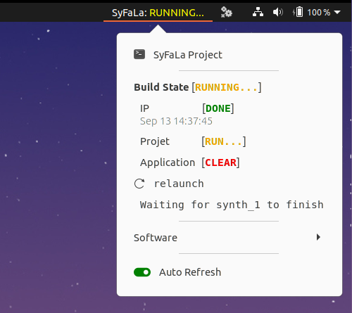

## Disclaimer
Argos is a GNOME Shell extensions for writing custom topbar plug-ins.  
This script add a nice SyFaLa monitoring.  
  

## Install Argos
https://github.com/p-e-w/argos  
  
Didn't work on my PC (Ubuntu LTS 20.04),the menus did not open: https://github.com/p-e-w/argos/issues/120  
You have to install this version instead: https://github.com/rammie/argos/tree/gnome-3.36  
**In this case, install it manually, don't use GNOME Shell Extensions website**  

## Install the Syfala plugin

Go to: ~/.config/argos  
Replace the script already present with syfala.+.sh.  
Change the "project_directory" variable in  syfala.+.sh.  
