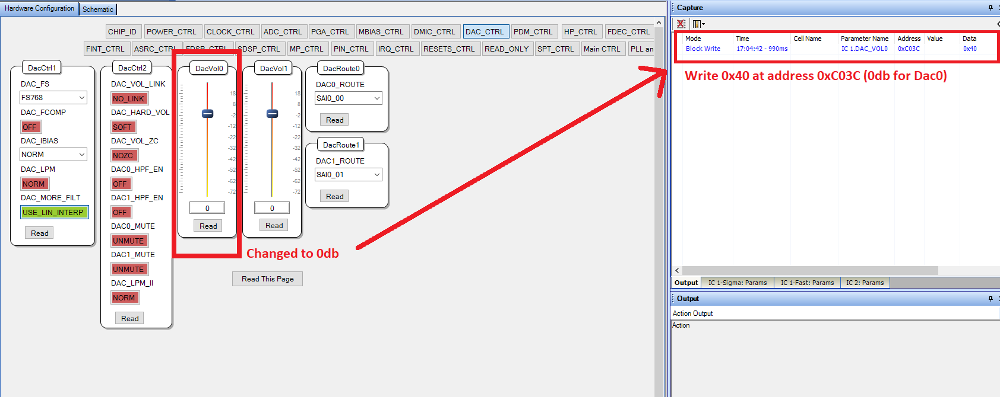
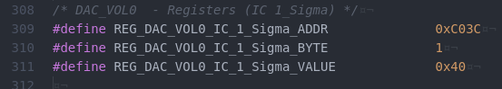

## Disclaimer (WARNING!)
  
This script generates the .c file that is used to read the header configuration file generated by SigmaStudio for the ADAU codecs configuration.  

The register values ​​(and therefore the configuration) of the codec are in the header files (AUAD1787.h, ADAU1777.h, etc...). So ADAU17XX.c is therefore never supposed to be regenerated.  

If you use this script, know what you are doing!  

If you just want to change some registers value, please follow the **"Change Registers Value"** part.  

## How to use it
  
After the configuration is done with SigmaStudio, generate the headers file with the "Export System Files" button  
  

  
**FOR ADAU1787**:  Find the **"[myproject]_IC_1_SIGMA_REG.h"** header file (not [myproject]_IC_1__**FAST**_REG.h !!)  
**FOR ADAU1777**:  Find the **"[myproject]_IC_1_REG.h"** header file  

Rename this file in ADAU17XXReg.h and put it in argument of the tcl script.  

The ADAU17XX.c file should be generated.

## Change Registers Value

If you want to change a register value, follow this guide.  

### Change a few values (preferred)

If you just want to quickly change some parameters, first locate the register(s) of the ADAU that correspond to the parameter you want to change. 
For that, you can either read the datasheet or directly use Sigma Studio:  

When you change a value in Sigma Studio check in the right panel the changes uploaded on the Codec and note its address and its new value.  
   

  
Then, find the corresponding register in ADAU1787.h and change it's value according to the change that SigmaStudio made.  
  

  
That's all!  

### Change the entire configuration (careful)

You can change the entire configuration: after the configuration is done with SigmaStudio, generate the headers file with the button "Export System Files" button  
  

  

**FOR ADAU1787**:  Find the **"[myproject]_IC_1_SIGMA_REG.h"** header file (not [myproject]_IC_1__**FAST**_REG.h !!)  
**FOR ADAU1777**:  Find the **"[myproject]_IC_1_REG.h"** header file  

Rename this file in ADAU17XXReg.h, this is your new header file, change it in your project.  

But SigmaStudio is a little bit tricky and it can automatically change some register even if you didn't change anything.  

For exemple, registers 0xC061, 0xC081 and 0xC05 are automatically respectively on 0x01 (Fast DSP ON), 0x01 (Sigma DSP ON) and 0x01 (PLL ON). Even if you don't want this configuration. (You probably want all of them at 0x00 to disable PLL and unused DSP).  

So if you use this methode it can be wise to check the difference between your new file and the actual header file to check if only the registers you want to change are affected.  

